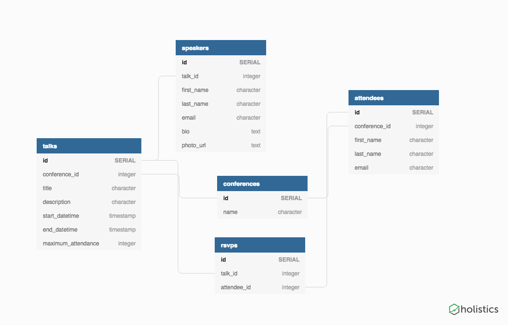

# Task Specification

We organising and hosting a leading FinTech conference. We need to 
build an event page to showcase the Talks and Speakers for the 
upcoming conference. The event consists of a number of talks, some speakers and, of course, 
attendees. Write a back-end service using Node.js to support an imaginary 
single-page-application front-end. 

# Instructions 
- $ npm install
- $ psql   
    -->  CREATE DATABASE conference;   
     -->  CREATE DATABASE conference_test;
- $ knex migrate:latest  
  --> for running the database migrations on the development database 'conference'
- $ knex migrate:latest --env test  
  -> for running the db migrations on the test database 'conference_test'
- $ npm run start  
  --> for running the server

- $ npm run test:integration   
  --> for running the tests.
  The seed data for the tests it's located at ./src/db/seeds 
# Technologies
- The is build API using Node.js and Express server framework

- The database is PostgresSQL, having used Knex for connecting to and querying the database

- request-promise HTTP request which has support for Promise

- For integration testing I have used Mocha(test framework running on Node.js), Chai(BDD / TDD assertion library), Chai-Properties(properties matcher for chai) and  Chai-HTTP(making the http requests)

# Design

## Database Diagram

For more details on unique, notNullable or unique together constrains please consult the migrations file located at 
 ./src/db/migrations/20190210164546_conferences.j

See below the entity relationship high level diagram which describes the following relationships/assumptions:
- One CONFERENCE can have many TALKS   
  One TALK can be part of only one CONFERENCE   
  --> no limit on attendee per conference; a maximum attendance per conference remains to be implemented similar to the one per talk

- One TALK can have many SPEAKERS   
  One SPEAKER can only have one TALK

- One ATTENDEE can attend only one CONFERENCE (chosen scenario for this DB design)   
  One CONFERENCE can have many ATTENDEES

The many to many relationship between talks and attendees it's addressed by creating the RSVPS table:
  - One ATTENDEE can attend many RSVPS  
    One RSVP can have only one ATTENDEE
  - One TALK can attend many RSVPS  
    One RSVP can have only one TALK

# REST API Architecture

The API follows a restful architectural style, with dedicated endpoints to perform CRUD operations by resource:

- POST /conferences --> to create a conference resource

- POST /conferences/:conferenceID/talks --> to create a talk resource   
GET /talks --> to retrieve all talks  

- POST /conferences/:conferenceID/attendees --> to create a attendee resource   
GET /attendees --> to retrieve all attendees  

- POST/talks/:talkID/speakers --> to create a speaker resource   
GET /talks/:talkID/speakers --> to retrieve speakers by talkID  
GET /speakers --> to retrieve all speakers

- POST rsvps/talks/:talkID/attendees/:attendeeID --> to create a rsvp resource   
GET /rsvps/talks/:talkID --> to retrieve rsvps by talkID  
GET /rsvps --> to retrieve all rsvps

It's important to mention that in order to get the duration of the talk, front end will need to calculate it based on the difference between start_datetime & end_datetime.

To see the available free spaces per talk, the rsvps by talkID will be retrieved from GET /rsvps/talks/:talkID, the length of the rsvps will be calculated and substracted from the maximum_attendace per talk. The front end can cache the number of rsvp and a short expiry time could be set

Furthermore, before an action of inserting a new RSVP for a talkID in a database, a list of all rsvps by talkID it's retrieved and only if it's length it's than the maximum attendance the insertion in the database it's performed ---> see #createRsvp function in app/src/db/queries.js & app/tests/integration/rvsps.spec.js for corresponding integration tests.

# Important issues not yet addressed in the challenge due to time constrains: 
- implement error handling for knex as currently any error triggered by the database has the status code 500. The errors triggered should be differentiated e.g. 409 Conflict/Duplication when trying to insert an already existing email for an attendee or  404 Not Found if a talk_id does not exists
- possible racing conditions when too many rsvps requests are done at the same time e.g. though available spaces could be displayed, the rsvp could not be done as another attendee might have just made a rsvps in between the first call to rsvp
- unit tested the db queries, controller and router files
- implemented a logger
- created a swagger for documenting the API, where I would have mentioned the required and option query strings
- used a middleware to validate the swagger files
